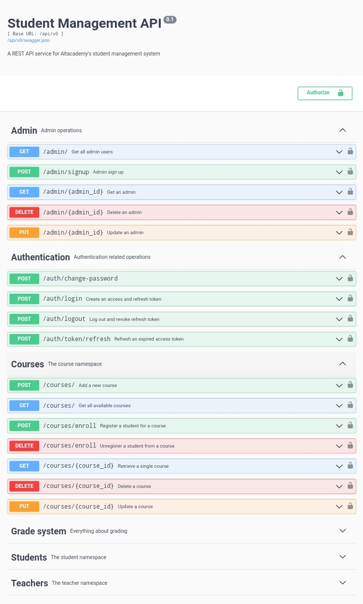

## Student Management API

### This is a RESTful API for a student management system. The API allows for the management of student data, including personal information and academic records. It can be used as backend for a student management system or any other application that requires management of student's data. <br> <br> 

### Stack
The API was built using [Python](https://python.org) and the Flask framework along with some extensions especially Flask-Restx, Flask-SQLAlchemy, Flask-JWT-Extended, etc. and using SQLite as database.
 <br> <br>
### API Overview <br>

<ul>

#### <li> Authentication </li>
The API uses JWT-based authentication and authorization mechanism to ensure that only authorized users can access protected endpoints. Each request must include a valid access token in the authorization header. This access token is obtained by logging in a user via the `auth/login` endpoint. The API checks the validity of this token before processing the request.


#### <li> Authorization </li>
The API supports role-based authorization. It restricts access to certain endpoints and operations based on the roles assigned to users. Upon account creation, every user is assigned a role and this role is stored in the JWT token. The role defines what actions the user is allowed to perform within the system.   
The roles include; _**student**_, **_staff_** and **_admin_**.
The admins have overall access to almost every endpoint.

#### <li> Admin only operations </li>
Some endpoints and operations are only limited to users with admin role as they are users who actually manage the API.  Some of these operations includes;
<ul>
  <li> Creating new accounts for students and teachers </li>
  <li> Generating school ID for students </li>
  <li> Creating and updating courses </li>
  <li> Updating of student or teacher's information </li>
  <li> Deleting a student, teacher or course, etc. </li>
</ul>

<br>
When teachers or students accounts are created by the admin, a default password is set. Students can then use the generated school ID and teachers their email address to log in.


#### <li> Student related operations </li>
Operations that are open to the students who are the primary users of the API are;
<ul>
    <li> Viewing their profile  </li>
    <li> Retrieving a course to view it's details</li>
    <li> Register/enroll for a particular course/courses </li>
    <li> View their grade in all their registered courses and also their GPA, etc. </li>
</ul>

#### <li> Teacher related operations </li>
<ul>
  <li> View their profile </li>
    <li> View the list of courses and course they're handling </li>
  <li> Grade a student and update a student's in the course they are registered to. </li>
</ul>

#### <li> Tests </li>
The API includes unit tests that evaluates the functionality of the API to ensure that all endpoints are working correctly and give the expected response. Here are some of the scenarios the tests cover:
<ul>
<li> Creating access and refresh tokens </li>
<li> Creating a new student, teacher and course </li>
<li> Updating and deleting an existing student record </li>
<li> Updating and deleting a course </li>
<li> Registering and unregistering a student for a course </li>
<li> Accessing unauthorized endpoints </li>
<li> Grading a student in particular course, etc.</li>
<li> Updating a student's grade in a particular course, etc.</li>
</ul>
</ul>
<br>  

### API Documentation & Usage
An interactive swagger documentation of the API can be accessed at _[altacad.pythonanywhere.com](https://altacad.pythonanywhere.com)._ It provides detailed information about all the available endpoints and their parameters. <br> <br>
To use the API:
1. Open your browser to the link above
2. Create an admin account using the `admin/signup` endpoint.
3. Go to the `auth/login` endpoint and log in using the email address and password you provided upon signing up. An access token and refresh token would be generated.
4. Copy the access token, click on the **_Authorize_** tab on the top right and paste the token in this format:
    
      ```
      Bearer <JWT access token>
      ```
5. Click on **_Authorize_** and then **_Close_**. You are now authorized to carry out any operation. Create account for students, teachers, create courses, update and even delete them. 
6. When you're done, click on the **__Authorize__** tab and select **__Logout__**

<br>

### Swagger documentation

 

<br>

**NOTE**: 
If you want to use and test the API using tools like Postman, Insomnia, Thunderclient, and the likes, base URL of the API is at [altacad.pythonanywhere.com/api/v0](https://altacad.pythonanywhere.com/api/v0/)

So you can start testing with the following endpoints

| Endpoints                         | Method | Description                                                            | Authorization             |
|-----------------------------------|--------|------------------------------------------------------------------------|---------------------------|
| _/admin/signup_                   | POST   | Creates a new admin account                                            | None                      |
| _/auth/login_                     | POST   | Creates JWT access and refresh tokens                                  | None                      |
| _/students_                       | GET    | Returns a list of all students                                         | Admin                     |
| _/students/\<id>_                 | GET    | Returns a student by ID                                                | Admin or specific student |
| _/students/\<id>/result_          | GET    | Returns a student by ID with their GPA and grades in all their courses | Admin or specific student |
 | _/teachers_                       | GET    | Return a list of all teachers                                          | Admin                     |
| _/courses_                        | GET    | Returns a list of all courses                                          | Admin or teacher          |
  | _/courses_                        | POST   | Creates a new course                                                   | Admin                     |
| _/courses/enroll_                 | POST   | Registers a student for a course(s)                                    | Specific student          |
| _/courses/\<id>_                  | GET    | Returns a course by ID and all students registered to the course       | Admin or specific student |
| _/grade/<student_id>/<course_id>_ | GET    | Returns a student's grade in a course                                  | Admin or teacher          |
| _/grade/<student_id>/<course_id>_ | POST   | Grades a student in a course                                           | Staff                     |

These are just some 'demanded' endpoints. You can check out the remaining endpoints in the swagger documentation

<br> 

### License

This project is licensed under the terms of the MIT license. See [LICENSE](LICENSE) for more information. <br> <br>

### Conclusion 

This project was given an as exam project by [Altschool Africa School of 
Engineering](https://altschoolafrica.com/schools/engineering) Backend Engineering track.

It was a great learning experience for me as I got to build my first RESTful API with Flask. The API provides CRUD functionality for managing students' data. It also uses JWT authentication and validation to secure the endpoints. I learned how to implement RESTful principles using Flask-Restx namespaces and decorators, how to use Postman to test and document my API requests and responses, and how to deploy my application on [PythonAnywhere](https://pythonanywhere.com).

I would like to thank my tutor Caleb Emelike for his amazing flask lessons and the organizers at Altschool Africa. 

If you have any questions or suggestions about this project, feel free to contact me at [akpulukelvin@gmail.com](mailto:akpulukelvin@gmail.com) or open an issue on GitHub.
